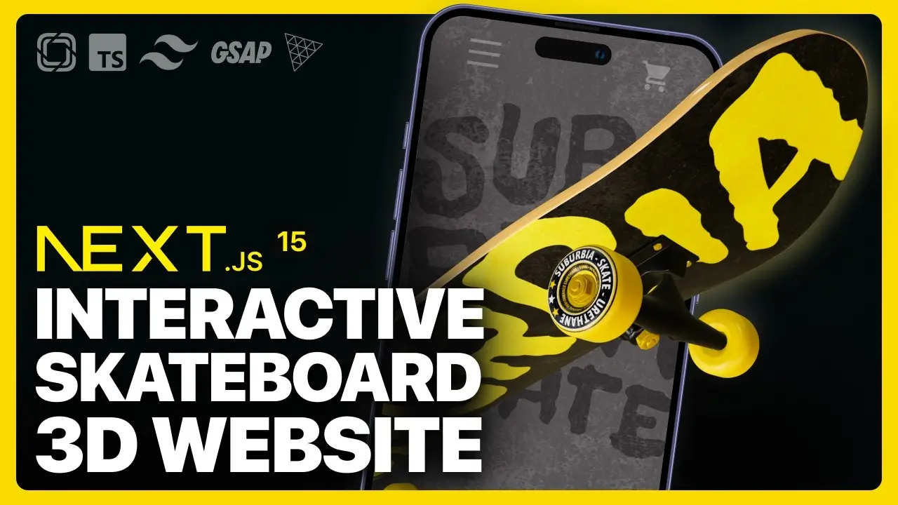

<div align="center">
  <br />
  <a href="https://suburbia-skate.vercel.app/" target="_blank">
    
  </a>
  <br />

  <div>
    
    
    
    
    
    
    
    
    
  </div>

  <div align="center">
    <h3>🛹 Suburbia Skate</h3>
    A modern, interactive skateboard website with 3D animations using <b>Next.js 15, TailwindCSS, Prismic CMS, and React Three Fiber</b>.<br/>
    <i>Built step by step with Slice Machine and GSAP for smooth animations.</i>
  </div>

  <br />

  <a href="https://suburbia-skate.vercel.app/" target="_blank">
    
  </a>
  <br />
</div>

---

## 📋 Table of Contents

1. ✨ [Introduction](#introduction)
2. ⚙️ [Tech Stack](#tech-stack)
3. 🔋 [Features](#features)
4. 🤸 [Quick Start](#quick-start)
5. 🧱 [Project Structure](#project-structure)
6. 📝 [Customization](#customization)
7. 🔗 [Contacts](#contacts)

---

## ✨ Introduction

Suburbia Skate is an interactive skateboard website showcasing products and 3D experiences using React Three Fiber. Users can explore products, view 3D skateboards, and interact with animations powered by GSAP. The site is powered by **Next.js 15**, **TailwindCSS**, and **Prismic CMS** for easy content management.

---

## ⚙️ Tech Stack

#### ⚡ Framework & Core

* **[Next.js 15](https://nextjs.org/)** – Full-stack React framework for SSR, SSG, and ISR.
* **React 19 (RC)** – Component-based UI library.
* **TypeScript 5** – Adds static typing for scalable and maintainable code.

#### 🎨 Styling & UI

* **[Tailwind CSS 3.4](https://tailwindcss.com/)** – Utility-first CSS framework for fast, responsive design.
* **Fluid Tailwind** – Responsive fluid typography & spacing.
* **clsx** – Conditional class management for dynamic styling.
* **React Icons** – Ready-to-use icon sets for React.

#### 📦 CMS & Content

* **[Prismic](https://prismic.io/)** – Headless CMS for managing dynamic content.

  * `@prismicio/client`, `@prismicio/react`, `@prismicio/next` – Prismic SDKs for client & Next.js integration.
* **Slice Machine** – Local custom type & slice builder for Prismic content modeling.

#### 🎬 Animation

* **[GSAP 3.12](https://greensock.com/gsap/)** – Advanced animation library with timeline control.
* **@gsap/react** – React integration for GSAP animations.

#### 🖼 3D & Physics

* **[Three.js 0.171](https://threejs.org/)** – Core 3D rendering engine.
* **React Three Fiber** – React renderer for Three.js to integrate 3D scenes seamlessly.
* **[@react-three/drei](https://github.com/pmndrs/drei)** – Helper components for React Three Fiber (OrbitControls, loaders, etc.).
* **Matter.js** – Physics engine for skateboard tricks, collisions, and hitboxes.

#### 🧹 Tooling

* **ESLint** + `eslint-config-next` – Code linting & formatting.
* **PostCSS** – CSS processing & optimization.
* **Turbopack** – Blazing fast local development server (`next dev`).

---

## 🔋 Features

* **Landing Page** – Engaging homepage with animated hero sections.
* **3D Skateboard Models** – Interactive 3D skateboard models with rotation and floating effects.
* **Dynamic Content** – Pages and product content managed via Prismic CMS.
* **Custom Animations** – Smooth animations powered by GSAP and React Three Fiber.
* **Responsive Design** – Fully responsive layout for desktop, tablet, and mobile.
* **Reusable Components** – Modular UI components for faster development.

---

## 🤸 Quick Start

### Prerequisites

* [Git](https://git-scm.com/)
* [Node.js](https://nodejs.org/en/)
* [npm](https://www.npmjs.com/)

### Clone the Project

```bash
git clone https://github.com/Itssanthoshhere/Suburbia-Skate.git
cd Suburbia-Skate
```

### Install Dependencies

```bash
npm install
```

### Run the Development Server

```bash
npm run dev
```

Visit [http://localhost:3000](http://localhost:3000) to see the project live.

---

## 🧱 Project Structure

| File/Component              | Description                                                |
| --------------------------- | ---------------------------------------------------------- |
| `app/layout.tsx`            | Layout wrapper and global providers                        |
| `app/page.tsx`              | Homepage rendering                                         |
| `slices/*/index.tsx`        | Prismic slice components                                   |
| `components/Bounded.tsx`    | Layout wrapper with consistent padding                     |
| `components/Button.tsx`     | Styled buttons connected to Prismic content                |
| `components/Header.tsx`     | Top navigation bar with branding                           |
| `components/Footer.tsx`     | Footer with rotating SVG and animations                    |
| `components/ViewCanvas.tsx` | 3D canvas for rendering skateboards with React Three Fiber |

---

## 📝 Customization

### Create Pages with Prismic Slices

1. Open [Prismic Dashboard](https://prismic.io/dashboard)
2. Create a new **Page**
3. Add slices (rich text, images, or custom components)
4. Publish and view at `/your-page-slug`

### Preview Content

Supports Prismic **Preview Mode** for local development.
🔗 [Preview Drafts in Next.js](https://prismic.io/docs/technologies/preview-content-nextjs)

---

## 🔗 Contacts

* GitHub: [Itssanthoshhere](https://github.com/Itssanthoshhere)
* LinkedIn: [Santhosh VS](https://www.linkedin.com/in/thesanthoshvs/)

---

#### ⭐ Show Your Support

If you enjoyed this project, **give it a ⭐** and share it with your network!

---

